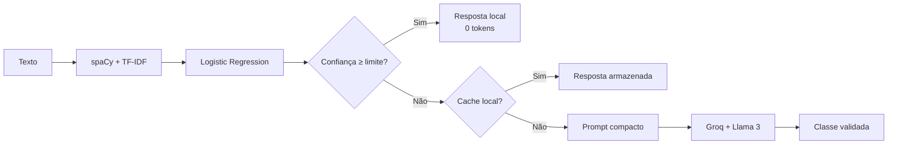

# Token-Efficient NLP Router — spaCy + Groq Llama

[](https://www.python.org/)
[](https://spacy.io/)
[](https://console.groq.com/docs/)
[](https://console.groq.com/docs/models)

Classificação de textos em português com execução local e fallback seletivo para modelos Llama hospedados na Groq. O modelo local resolve casos confiáveis sem consumir tokens; a Groq recebe apenas casos incertos.

## Arquitetura



## Como a economia acontece

- casos confiáveis são classificados localmente;
- somente baixa confiança é escalada;
- o texto é normalizado e limitado antes do envio;
- respostas repetidas usam cache local;
- a saída é limitada a 60 tokens e somente JSON;
- labels retornadas pela Groq são validadas contra a taxonomia do modelo.

A aplicação compara o consumo real com uma estimativa do cenário em que 100% dos textos seriam enviados ao LLM.

## Modelos Groq

| Modelo | Perfil | Uso sugerido |
|---|---|---|
| `llama-3.1-8b-instant` | mais rápido e econômico | fallback padrão de classificação |
| `llama-3.3-70b-versatile` | maior capacidade | classes ambíguas ou textos complexos |

Os dois são modelos de produção da Groq. Consulte a [lista atual de modelos](https://console.groq.com/docs/models) antes de implantar.

## Estrutura

```text
src/token_efficient_nlp/
├── preprocessing.py   # normalização spaCy
├── model.py           # TF-IDF + Logistic Regression
├── router.py          # confiança, cache e fallback
├── providers.py       # Groq Chat Completions
├── metrics.py         # cobertura e tokens
├── cli.py             # treino e inferência
└── api.py             # FastAPI
tests/
examples/sample_events.csv
```

## Instalação

```bash
git clone https://github.com/viniciusds2020/nlp_classificacao_texto_spacy.git
cd nlp_classificacao_texto_spacy

python -m venv .venv
source .venv/bin/activate  # Linux/macOS
# .venv\Scripts\activate # Windows

pip install -e ".[all]"
python -m spacy download pt_core_news_sm
```

## Treinamento local

```bash
token-nlp train \
  --data examples/sample_events.csv \
  --text-column text \
  --label-column label \
  --output artifacts/classifier.joblib
```

## Configuração

Execução totalmente local:

```env
MODEL_PATH=artifacts/classifier.joblib
LOCAL_CONFIDENCE_THRESHOLD=0.80
GROQ_ENABLED=false
```

Fallback econômico com Llama 3.1 8B:

```env
GROQ_ENABLED=true
GROQ_API_KEY=gsk_...
GROQ_MODEL=llama-3.1-8b-instant
MAX_PROMPT_CHARS=2000
```

Para maior capacidade:

```env
GROQ_MODEL=llama-3.3-70b-versatile
```

## Executar API

```bash
token-nlp-api
```

Swagger: `http://localhost:8000/docs`.

```bash
curl -X POST http://localhost:8000/classify \
  -H "Content-Type: application/json" \
  -d '{"text":"fumaça saindo do painel elétrico"}'
```

Resposta:

```json
{
  "label": "Incêndio",
  "confidence": 0.91,
  "source": "local",
  "reason": "confidence_threshold",
  "provider": null,
  "model": null,
  "input_tokens": 0,
  "output_tokens": 0,
  "estimated_tokens_avoided": 89,
  "cached": false
}
```

Quando escalado:

```json
{
  "label": "Incêndio",
  "confidence": 0.88,
  "source": "llm",
  "reason": "low_local_confidence",
  "provider": "groq",
  "model": "llama-3.1-8b-instant",
  "input_tokens": 74,
  "output_tokens": 12,
  "cached": false
}
```

## Métricas

`GET /metrics`:

```json
{
  "requests": 10000,
  "local_decisions": 8700,
  "llm_escalations": 900,
  "cache_hits": 400,
  "estimated_llm_only_tokens": 1600000,
  "actual_input_tokens": 115000,
  "actual_output_tokens": 18000,
  "tokens_avoided": 1467000,
  "local_resolution_rate": 0.87
}
```

Os valores são ilustrativos. A economia real depende da cobertura local, repetição dos textos, limite de confiança e modelo escolhido.

## Escolha do limite

Calibre `LOCAL_CONFIDENCE_THRESHOLD` em validação:

| Limite | Cobertura local | Precisão seletiva | Uso da Groq |
|---:|---:|---:|---:|
| menor | maior | tende a diminuir | menor |
| maior | menor | tende a aumentar | maior |

Acompanhe macro F1, recall por classe, precisão dos casos aceitos localmente, escalonamento, latência e tokens por classificação.

## Segurança

- as chaves ficam apenas em variáveis de ambiente;
- textos locais não saem do ambiente;
- o prompt trata o texto como conteúdo não confiável;
- a resposta precisa pertencer à lista de classes;
- limite de saída reduz custo e superfície de geração;
- dados pessoais devem ser anonimizados antes do fallback.

## Desenvolvimento

```bash
pip install -e ".[dev]"
ruff check src tests
pytest --cov=token_efficient_nlp
```

Os testes usam provedor falso e não realizam chamadas à Groq.

## Roadmap

- [ ] calibração de probabilidades;
- [ ] curva cobertura × precisão × tokens;
- [ ] cache Redis;
- [ ] métricas Prometheus;
- [ ] anonimização de PII antes do fallback;
- [ ] Groq Batch API para cargas não urgentes;
- [ ] comparação Llama 3.1 8B × Llama 3.3 70B.

## Autor

Desenvolvido por [Vinicius de Sousa](https://github.com/viniciusds2020).
