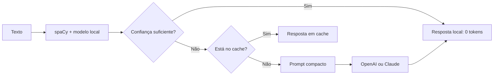

# Token-Efficient NLP Router

[](https://www.python.org/)
[](https://spacy.io/)
[](https://platform.openai.com/docs/)
[](https://docs.anthropic.com/)

Solução local-first para classificação de textos em português. spaCy, TF-IDF e Logistic Regression resolvem os casos confiáveis localmente; OpenAI ou Claude recebem apenas casos de baixa confiança.

O objetivo é reduzir tokens, custo, latência e exposição de dados sem abandonar a capacidade de generalização dos LLMs.

## Estratégia



A solução economiza tokens em quatro pontos:

1. **Resolução local:** nenhuma chamada externa quando a confiança ultrapassa o limite;
2. **fallback seletivo:** somente amostras incertas chegam ao LLM;
3. **compactação:** spaCy remove stop words, pontuação e redundância antes do prompt;
4. **cache:** textos repetidos não geram outra chamada.

## Quando usar

- classificação de chamados e tickets;
- roteamento de documentos;
- categorização de eventos e riscos;
- classificação de intenção;
- triagem de e-mails ou mensagens;
- moderação baseada em taxonomia conhecida;
- pré-roteamento antes de agentes ou RAG.

A abordagem funciona melhor quando as classes são conhecidas e existe histórico rotulado. Tarefas abertas de geração, resumo ou raciocínio continuam sendo responsabilidade do LLM.

## Arquitetura do projeto

```text
src/token_efficient_nlp/
├── preprocessing.py   # normalização em lote com spaCy
├── model.py           # TF-IDF + Logistic Regression
├── router.py          # confiança, cache e fallback
├── providers.py       # OpenAI Responses API e Claude Messages API
├── metrics.py         # tokens e cobertura local
├── cli.py             # treinamento e inferência
└── api.py             # FastAPI
tests/
examples/
modelo.py              # entrada de compatibilidade
```

## Instalação

```bash
git clone https://github.com/viniciusds2020/nlp_classificacao_texto_spacy.git
cd nlp_classificacao_texto_spacy

python -m venv .venv
source .venv/bin/activate  # Linux/macOS
# .venv\Scripts\activate # Windows

pip install -e ".[all]"
python -m spacy download pt_core_news_sm
```

Sem o modelo treinado de português, a aplicação utiliza `spacy.blank("pt")` como fallback de tokenização.

## Treinamento

O arquivo deve conter uma coluna de texto e outra de classe:

```csv
text,label
"colaborador sem capacete na área operacional","EPI"
"presença de fumaça no painel elétrico","Incêndio"
```

```bash
token-nlp train \
  --data examples/sample_events.csv \
  --text-column text \
  --label-column label \
  --output artifacts/classifier.joblib
```

A CLI realiza split estratificado, imprime o relatório de classificação e salva modelo, vetorizador, labels e metadados em um único artefato.

## Inferência local

```bash
token-nlp predict \
  --model artifacts/classifier.joblib \
  --text "Iluminação deficiente com risco de tropeço"
```

```python
from token_efficient_nlp import LocalTextClassifier

model = LocalTextClassifier.load("artifacts/classifier.joblib")
prediction = model.predict_one("Iluminação deficiente na passarela")

print(prediction.label)
print(prediction.confidence)
print(prediction.alternatives)
```

## Configuração do fallback

Copie `.env.example` para `.env` e selecione um provedor:

```env
MODEL_PATH=artifacts/classifier.joblib
LOCAL_CONFIDENCE_THRESHOLD=0.80
MAX_PROMPT_CHARS=2000

LLM_PROVIDER=openai
OPENAI_API_KEY=...
OPENAI_MODEL=gpt-5-mini
```

Para Claude:

```env
LLM_PROVIDER=anthropic
ANTHROPIC_API_KEY=...
ANTHROPIC_MODEL=claude-haiku-4-5
```

Os nomes de modelos devem ser revisados conforme disponibilidade da conta. Consulte a documentação oficial da [OpenAI](https://platform.openai.com/docs/models) e a lista de [modelos Claude](https://docs.anthropic.com/en/docs/about-claude/models/overview).

## API

```bash
token-nlp-api
```

Documentação interativa: `http://localhost:8000/docs`.

### Classificar

```bash
curl -X POST http://localhost:8000/classify \
  -H "Content-Type: application/json" \
  -d '{"text":"fumaça saindo do equipamento"}'
```

A resposta informa a origem da decisão:

```json
{
  "label": "Incêndio",
  "confidence": 0.91,
  "source": "local",
  "reason": "confidence_threshold",
  "input_tokens": 0,
  "output_tokens": 0,
  "estimated_tokens_avoided": 89,
  "cached": false
}
```

Rotas disponíveis:

| Método | Rota | Finalidade |
|---|---|---|
| `GET` | `/health` | saúde e classes do modelo |
| `POST` | `/classify` | classificação unitária |
| `POST` | `/classify/batch` | classificação em lote |
| `GET` | `/metrics` | economia e roteamento |

## Métricas de economia

```json
{
  "requests": 10000,
  "local_decisions": 8700,
  "llm_escalations": 900,
  "cache_hits": 400,
  "estimated_llm_only_tokens": 1600000,
  "actual_input_tokens": 115000,
  "actual_output_tokens": 18000,
  "tokens_avoided": 1467000,
  "local_resolution_rate": 0.87
}
```

Os números acima são apenas um exemplo de formato. O projeto calcula:

```text
tokens evitados =
tokens estimados se todas as requisições usassem LLM
− tokens efetivamente consumidos
```

Para uma avaliação honesta, compare também:

- macro F1 e recall por classe;
- cobertura local;
- precisão seletiva por faixa de confiança;
- taxa de escalonamento;
- latência p50/p95;
- tokens médios por requisição;
- custo por mil classificações.

## Escolha do limite de confiança

O valor `0.80` é apenas inicial. Selecione o limite em uma base de validação:

| Limite | Cobertura local | Qualidade esperada | Uso de LLM |
|---:|---:|---:|---:|
| menor | maior | menor | menor |
| maior | menor | maior | maior |

A métrica principal deve ser a precisão dos casos aceitos localmente, não apenas a acurácia global.

## Segurança e privacidade

- O texto é tratado como dado não confiável no prompt;
- a resposta do provedor deve pertencer à lista de classes;
- chaves não são armazenadas no repositório;
- textos resolvidos localmente não saem do ambiente;
- dados sensíveis devem ser anonimizados antes de qualquer fallback externo;
- em produção, adicione autenticação, rate limiting e armazenamento externo para cache/métricas.

## Testes

```bash
pip install -e ".[dev]"
ruff check src tests
pytest --cov=token_efficient_nlp
```

Os testes usam provedor falso e não consomem tokens reais.

## Limitações e roadmap

- [ ] calibração de probabilidades;
- [ ] curva cobertura × precisão;
- [ ] cache Redis;
- [ ] persistência Prometheus/OpenTelemetry;
- [ ] fila de revisão humana;
- [ ] detecção e anonimização de PII;
- [ ] Batch API para casos não urgentes;
- [ ] comparação experimental OpenAI × Claude × modelo local.

## Autor

Desenvolvido por [Vinicius de Sousa](https://github.com/viniciusds2020).
